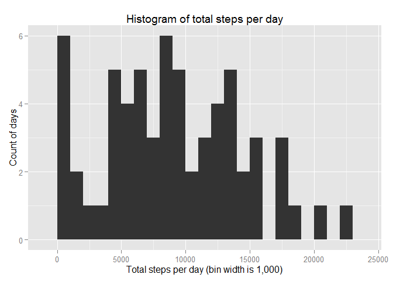
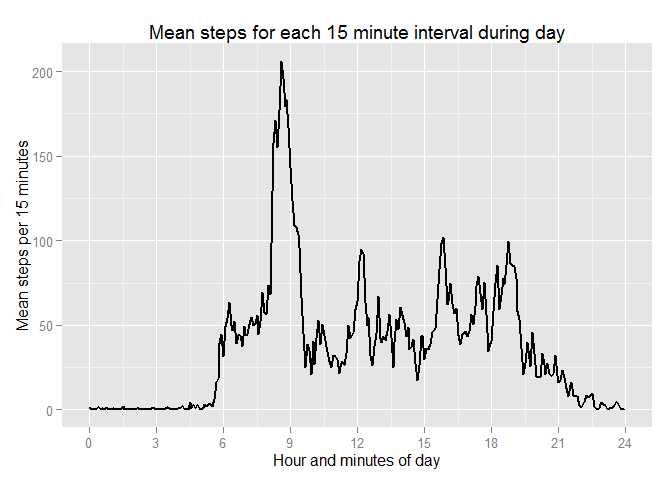
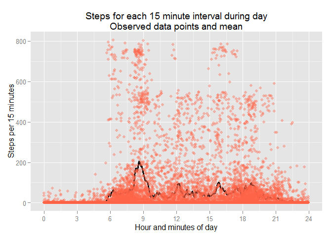
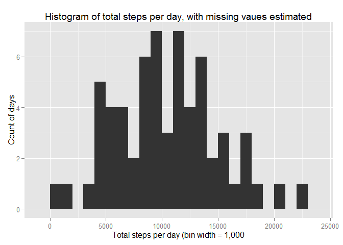
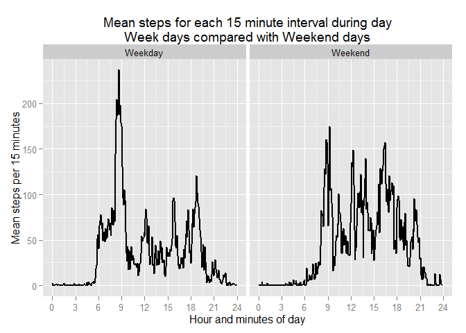
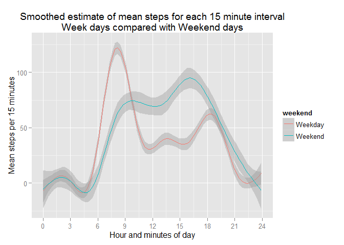

# Reproducible Research: Peer Assessment 1
author: Jim Pearse
date: Sunday, March 15, 2015


### Load the necessary packages and set the working directory


```r
setwd ("D:\\Rprojects\\Reproducible\\RepData_PeerAssessment1")

library(lubridate)
library(dplyr)
library(stringr)                  
library(ggplot2)
```

### Load and preprocess the data

This step first checks whether there is a local file saved and if not downloads the data for the project from the web site.  If there is a local file saved this is loaded  this into memory.  We then view the data structure and the first six records.

The date and time variables are then coverted in a new variable 'dateB' of class PosiXct.  We also generate a new variable 'hourdec', which the the hour of the day with minutes expressed as decimals.  This helps with the plotting of time of day.


```r
if(!file.exists("activity.rds")) {
    urlref <- "https://d396qusza40orc.cloudfront.net/repdata%2Fdata%2Factivity.zip"
    download.file(urlref, destfile = "activity.zip")
    activity <- read.table(unz("activity.zip", "activity.csv"), header=T, quote="\"", sep=",")
    saveRDS(activity,"activity.rds")    
    }
{activity <- readRDS("activity.rds") }

#activity <- readRDS("activity.rds")

str(activity)
```

```
## 'data.frame':	17568 obs. of  3 variables:
##  $ steps   : int  NA NA NA NA NA NA NA NA NA NA ...
##  $ date    : Factor w/ 61 levels "2012-10-01","2012-10-02",..: 1 1 1 1 1 1 1 1 1 1 ...
##  $ interval: int  0 5 10 15 20 25 30 35 40 45 ...
```

```r
head(activity)
```

```
##   steps       date interval
## 1    NA 2012-10-01        0
## 2    NA 2012-10-01        5
## 3    NA 2012-10-01       10
## 4    NA 2012-10-01       15
## 5    NA 2012-10-01       20
## 6    NA 2012-10-01       25
```

```r
timeA <- str_pad(as.character(activity$interval), 4, pad = "0")
timeB <- paste(substr(timeA,1,2),":",substr(timeA,3,4),sep="")
activity$dateB <- as.POSIXct(strptime(paste(activity$date,timeB),"%Y-%m-%d %H:%M"))                
activity$hourdec <- round(hour(activity$dateB) + minute(activity$dateB)/60,digits=3)
```

### What is the mean total number of steps taken per day?

Use the summarise function to calculate the mean number of steps per day, removing the NAs.  Apply the mean function to the resulting data frame to calculate the total mean steps per day, also removing NAs (more specifically NaNs). 


```r
# 1. Calculated the total steps per day
totalperday <- summarise(group_by(activity,as.Date(dateB)), TotalSteps=sum(steps,na.rm=TRUE))
names(totalperday) <- c("Date","TotalSteps")
str(totalperday)
```

```
## Classes 'tbl_df', 'tbl' and 'data.frame':	63 obs. of  2 variables:
##  $ Date      : Date, format: "2012-09-30" "2012-10-01" ...
##  $ TotalSteps: int  0 0 8655 8850 12648 10057 17017 6096 8958 6852 ...
##  - attr(*, "drop")= logi TRUE
```

```r
# 2. Create a histogram of total steps per day
qplot(TotalSteps,data=totalperday, 
      xlab="Total steps per day (bin width is 1,000)", 
      ylab="Count of days",
      binwidth=1000)+
      ggtitle("Histogram of total steps per day")
```

 

```r
# 3. Calculate the mean and median steps per day
meantotal <- mean(totalperday$TotalSteps,na.rm=TRUE)
mediantotal <- median(totalperday$TotalSteps,na.rm=TRUE)
```
The mean total steps per day is 9057.2698413. 
The median ttoal steps per day is 8958. 

### What is the average daily activity pattern?

I used ggplot functions to produce these plots.


```r
# 1.  Make a time series plot of the 5-minute interval (x-axis) and the average number of steps taken, averaged across all days (y-axis)

plot2_ggp <- ggplot(activity,aes(x=hourdec,y=steps)) + 
             xlab("Hour and minutes of day") + 
             ylab("Mean steps per 15 minutes")
plot2_ggp <- plot2_ggp + scale_x_continuous(limits=c(0, 24),breaks = seq(0,24,by = 3))
plot2_ggp + stat_summary( fun.y=mean, geom="line", size=1.0) +  
            ggtitle("Mean steps for each 15 minute interval during day")
```

```
## Warning: Removed 2316 rows containing missing values (stat_summary).
```

 

```r
# Additional plot to examine actual data points

plot2A_ggp <- ggplot(activity,aes(x=hourdec,y=steps)) + 
             xlab("Hour and minutes of day") + 
             ylab("Steps per 15 minutes")
plot2A_ggp <- plot2A_ggp + scale_x_continuous(limits=c(0, 24),breaks = seq(0,24,by = 3))
plot2A_ggp + stat_summary( fun.y=mean, geom="line", size=1.2) + 
            geom_point(alpha=.4,color="tomato") +
            ggtitle("Steps for each 15 minute interval during day\nObserved data points and mean")
```

```
## Warning: Removed 2316 rows containing missing values (stat_summary).
```

```
## Warning: Removed 2316 rows containing missing values (geom_point).
```

 

```r
# 2. Which 5-minute interval, on average across all the days in the dataset, contains the maximum number of steps?
meanperinterval <- summarise(group_by(activity,interval), MeanSteps=mean(steps,na.rm=TRUE))
maxinterval <- meanperinterval[which.max( meanperinterval$MeanSteps),"interval"]
```

The time interval with the maximum average number of steps is 835. 

### Imputing missing values
Values were imputed using the mean by the 5 minute interval by the day of the week.


```r
# 1. Calculate and report the total number of missing values in the dataset (i.e. the total number of rows with NAs)

# Check Missing values

NArows <- sum(!complete.cases(activity))

Steps_NA <- sum(is.na(activity$steps))
Steps_NA
```

```
## [1] 2304
```

```r
Date_NA <- sum(is.na(activity$date))
Date_NA
```

```
## [1] 0
```

```r
Interval_NA <- sum(is.na(activity$interval))
Interval_NA
```

```
## [1] 0
```

There are 2316 rows with missing data in the data frame.  Further investigation whos that there are 2304 rows with a missing value of 'Step' representing 0.1311475% of rows.  There were 0 rows with 'Date' missing and 0 rows with 'Interval' missing 


```r
#2.  Create a new dataset that is equal to the original dataset but with the missing data filled in.

# Create a variable showing the day of the week
activity <- mutate(activity,weekday=weekdays(dateB,abbr = TRUE))

# Calculate the mean steps by day of week and time of day removing NAs
meanperinterval2 <- summarise(group_by(activity,hourdec,weekday), MeanSteps=mean(steps,na.rm=TRUE))

# Add these to the orginal dataframe and replace  missing values with these values
activity2 <- merge(activity,meanperinterval2,by=c("hourdec","weekday"))
activity2$steps <- ifelse(is.na(activity2$steps),activity2$MeanSteps,activity2$steps)

# Check that there are no missing values in the new variable
sum(is.na(activity2$steps))
```

```
## [1] 0
```

```r
# 3.  Make a histogram of the total number of steps taken each day and Calculate and report the mean and median total number of steps taken per day. Do these values differ from the estimates from the first part of the assignment? What is the impact of imputing missing data on the estimates of the total daily number of steps?

# Histogram of steps per days
totalperday2 <- summarise(group_by(activity2,as.Date(dateB)), TotalSteps=sum(steps,na.rm=TRUE))
names(totalperday2) <- c("Date","TotalSteps")

# Revised histogram of steps per days
qplot(TotalSteps,data=totalperday2, 
      xlab="Total steps per day (bin width = 1,000", 
      ylab="Count of days",binwidth=1000) +
      ggtitle("Histogram of total steps per day, with missing vaues estimated")
```

 

```r
# Revised mean and median
meantotal2 <- mean(totalperday2$TotalSteps,na.rm=TRUE)
mediantotal2 <- median(totalperday$TotalSteps,na.rm=TRUE)
```

The revised estimated mean is 1.0477681\times 10^{4} steps per day and the revised median is 8958.  These vary from the orginal estmates by 1.1568255% for the mean and 1% for the median, so the missing values make a big difference for the mean values. 

### Are there differences in activity patterns between weekdays and weekends?


```r
#1. Create a new factor variable in the dataset with two levels – “weekday” and “weekend” indicating whether a given date is a weekday or weekend day.
activity2$weekend <- factor(ifelse(activity2$weekday %in% c('Sat','Sun'),1,0),
                            labels = c('Weekday','Weekend'))


#2.Make a panel plot containing a time series plot (i.e. type = "l") of the 5-minute interval (x-axis) and the average number of steps taken, averaged across all weekday days or weekend days (y-axis). 

plot3_ggp <- ggplot(activity2,aes(x=hourdec,y=steps)) + 
              xlab("Hour and minutes of day") + 
              ylab("Mean steps per 15 minutes")
plot3_ggp <- plot3_ggp + scale_x_continuous(limits=c(0, 24),breaks = seq(0,24,by = 3))
plot3_ggp + stat_summary(fun.y=mean, geom="line", size=1.0) +
            facet_grid (. ~weekend) +
            ggtitle("Mean steps for each 15 minute interval during day\nWeek days compared with Weekend days")
```

```
## Warning: Removed 12 rows containing missing values (stat_summary).
```

 

The plot indicates there are clear differences between weekends and week days.  On week days activity increases around 6 am, but on weekends it increases later in the morning.  On week days there is a peak of activity between 8 and 9 am, but a dip in activity later in the morning. On weekends there is also a peak, but this is later.  On weekends activity is generally higher through the rest of the day. We can see some of the differences more cleary when we overall  smoother estimates for each of the day groups as is shown in the following plot


```r
plot3_ggp + stat_smooth(aes(color=weekend),span=0.01)  +
            ggtitle("Smoothed estimate of mean steps for each 15 minute interval\nWeek days compared with Weekend days")
```

```
## geom_smooth: method="auto" and size of largest group is >=1000, so using gam with formula: y ~ s(x, bs = "cs"). Use 'method = x' to change the smoothing method.
```

```
## Warning: Removed 12 rows containing missing values (stat_smooth).
```

 

